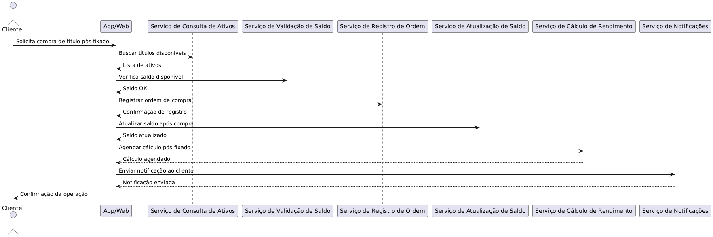

# Serviços - Arquitetura SOA

## 1. Processo de Investimento em Títulos com Juros Pré-Fixados

### 1.1. Objetivo
Permitir que o cliente realize a compra de títulos com rendimento pré-fixado, garantindo validações automáticas e comunicação com o sistema de registro de ativos.

### 1.2. Quem consome
App mobile e plataforma web.

### 1.3. Serviços utilizados e justificativas

#### 1.3.1. Consulta de Ativos Pré-Fixados

Filtra e exibe apenas os títulos com taxa de juros conhecida no momento da compra. Reutilizável em processos de recomendação e simulações financeiras. Executável via REST API, com granularidade baixa e alta autonomia.

#### 1.3.2. Validação de Perfil do Cliente
Verifica se o perfil de investidor do cliente (ex: conservador, moderado) é compatível com o ativo. Reutilizável em outros processos como recomendação de carteira e onboarding. Serviço técnico com decisão pontual.

#### 1.3.3. Validação de Saldo
Confirma se o cliente possui saldo suficiente. Serviço reutilizável em transações financeiras diversas. Executável automaticamente via API, granularidade baixa.

#### 1.3.4. Registro da Ordem de Compra
Formaliza a compra com o sistema de custódia de ativos. Serviço técnico clássico de SOA, interoperável, com escopo bem definido.

#### 1.3.5. Atualização de Saldo
Deduz valor da compra do saldo do cliente. Reutilizável em vários processos (pagamento, saque, crédito). Executável via REST.

#### 1.3.6. Notificações
Informa o cliente sobre a conclusão da compra. Reutilizável em diversas operações. Pode ser disparado por push, e-mail ou SMS.

### 1.4. Dados ou sistemas acessados:

- Sistema de registro de ativos
- Base de dados de ativos disponíveis (filtrados por tipo pré-fixado)
- Dados de saldo e perfil do cliente

### 1.5. Explicação

| Critério              | Aplicação no Processo de Investimento em Títulos com Juros Pré-Fixados               |
|-----------------------|----------------------------------------------------------------------------------------|
| Escopo                | Macroscópico – envolve diversas ações (consulta, validação, registro, notificação).   |
| Granularidade         | Alta – processo completo com várias etapas e decisões.                                |
| Reutilização          | Baixa no processo como um todo, mas alta nos serviços técnicos reutilizáveis.         |
| Composição            | Composto por tarefas técnicas (consultar ativos, registrar ordem) e decisões (validar saldo, confirmar operação). |
| Tecnologia            | Independente – pode ser descrito por BPMN, integrado a sistemas externos.             |
| Interface             | Interface de processo – fluxos BPMN, regras de negócio, integração com app/web.       |
| Autonomia Técnica     | Baixa – depende da orquestração de múltiplos serviços autônomos.                      |

## 2. Processo de Investimento em Títulos com Juros Pós-Fixados

### 2.1. Objetivo
Permitir que o cliente invista em ativos com rendimento atrelado a um indicador variável (ex: CDI), com validações específicas e comunicação com sistema de registro de ativos.

### 2.2. Quem consome
App mobile e plataforma web.

### 2.3. Serviços utilizados e justificativas

#### 2.3.1. Consulta de Ativos Pós-Fixados
Lista apenas os ativos vinculados a taxas variáveis. Utilizável também por sistemas de simulação de rendimento ou alertas de variação. Executável por API com granularidade baixa.

#### 2.3.2 Validação de Perfil do Cliente
Verifica se o cliente está apto a investir em produtos de renda variável ou indexados. Técnica pontual, reutilizável em outros fluxos.

#### 2.3.3 Validação de Saldo
Confere disponibilidade de saldo. Reutilizável. Executável de forma autônoma.

#### 2.3.4. Registro da Ordem de Compra
Formaliza a operação com sistema de registro de ativos. Interoperável e independente de plataforma (ex: REST, SOAP).

#### 2.3.5. Atualização de Saldo
Atualiza o saldo do cliente após o investimento. Usado em vários fluxos.

#### 2.3.6. Notificações
Informa o sucesso da operação. Reutilizável. Integra com múltiplos canais.

### 2.4. Dados ou sistemas acessados
- Sistema de registro de ativos
-  Base de dados de ativos disponíveis (filtrados por tipo pós-fixado)
- Dados de saldo e perfil do cliente

### 2.5. Explicação

| Critério              | Aplicação no Processo de Investimento em Títulos com Juros Pós-Fixados               |
|-----------------------|----------------------------------------------------------------------------------------|
| Escopo                | Macroscópico – cobre etapas do investimento com atualização de rendimento variável.   |
| Granularidade         | Alta – envolve múltiplas etapas e cálculos pós-negociação.                            |
| Reutilização          | Baixa no processo como um todo, mas os serviços são altamente reutilizáveis.          |
| Composição            | Composto por tarefas (consulta, validação, cálculo de rendimento) e decisões.         |
| Tecnologia            | Independente – abstração do fluxo, com uso de serviços técnicos via API (REST, etc). |
| Interface             | Interface de processo – modelagem BPMN, consumo por canais digitais.                  |
| Autonomia Técnica     | Baixa – o processo depende da composição de serviços autônomos, como cálculo pós-fixado. |

## 3. Processo de Saque de Dinheiro

### 3.1. Objetivo
Permitir que o cliente realize o saque de valores de sua conta para dinheiro físico ou transferência para outra conta, com validações automáticas de saldo e comunicação com sistemas financeiros e de autenticação.

### 3.2. Quem consome
- App mobile
- APIs de parceiros (ex: caixas eletrônicos, fintechs)

### 3.3. Serviços utilizados e justificativas

#### 3.3.1. Autenticação de Cliente
- **Justificativa:** Confirma a identidade do cliente antes de autorizar a operação de saque, garantindo segurança.
- **Características:** Serviço reutilizado por diversos processos (pagamentos, transferências, investimentos). Autônomo e executável via API, com granularidade baixa.

#### 3.3.2. Validação de Saldo
- **Justificativa:** Verifica se o cliente possui saldo suficiente para efetuar o saque.
- **Características:** Serviço técnico, pontual e reutilizável em processos como pagamentos, investimentos e transferências.

#### 3.3.3. Registro de Operação de Saque
- **Justificativa:** Formaliza a operação no sistema financeiro e contabiliza a saída de recursos.
- **Características:** Serviço SOA clássico, executável automaticamente, com escopo técnico bem definido. Pode ser implementado via REST ou SOAP.

#### 3.3.4. Atualização de Saldo
- **Justificativa:** Atualiza o saldo do cliente após a realização do saque, mantendo a consistência das informações financeiras.
- **Características:** Serviço altamente reutilizável por diversos processos (pagamentos, investimentos, etc).

#### 3.3.5. Notificações
- **Justificativa:** Envia aviso ao cliente confirmando o sucesso do saque.
- **Características:** Serviço compartilhado com vários outros processos (pagamentos, crédito, investimentos). Integra-se a múltiplos canais: push, email, SMS.

### 3.4. Dados ou sistemas acessados
- Banco de dados transacional (saldo, limite disponível)
- Sistema de autenticação
- Sistema de registro de operações financeiras
- Sistema de notificações

### 3.5. Explicação

| **Critério**       | **Aplicação no Processo de Saque**                                                                 |
|--------------------|---------------------------------------------------------------------------------------------------|
| **Escopo**         | Macroscópico – abrange autenticação, validação, execução e notificação.                            |
| **Granularidade**  | Alta – representa um processo completo de negócio.                                                 |
| **Reutilização**   | Baixa no processo (específico para saque), alta nos serviços utilizados (compartilhados).          |
| **Composição**     | Composto por tarefas técnicas e decisões de negócio.                                               |
| **Tecnologia**     | Independente – pode ser descrito em BPMN ou implementado com diferentes padrões (REST, SOAP, etc). |
| **Interface**      | Pode ser modelado em BPMN, consumido via app, APIs externas (ex: fintechs, caixas eletrônicos).     |
| **Autonomia Técnica** | Baixa – depende da orquestração de múltiplos serviços para sua execução.                        |

---

## 4. Processo de Solicitação de Empréstimo
### 4.1. Objetivo
Permitir que o cliente solicite um empréstimo pessoal de forma digital, com validações automáticas de perfil, análise de crédito, condições contratuais e liberação dos valores.

### 4.2. Quem consome
App mobile

Plataforma web

APIs de parceiros (ex: marketplaces financeiros)

### 4.3. Serviços utilizados e justificativas
#### 4.3.1. Consulta de Ofertas de Empréstimo
Justificativa: Lista as opções de empréstimo disponíveis para o cliente, considerando perfil, limites e regras de crédito.

Características: Serviço reutilizável em simulações, marketplaces e pré-ofertas. Executável via REST API, granularidade baixa e alta autonomia.

#### 4.3.2. Validação de Perfil do Cliente
Justificativa: Verifica se o cliente atende aos critérios básicos (ex.: idade, renda mínima, restrições cadastrais).

Características: Serviço técnico, utilizado também em outros fluxos como onboarding e concessão de crédito.

#### 4.3.3. Análise de Crédito
Justificativa: Avalia score, histórico financeiro, capacidade de pagamento e risco de inadimplência.

Características: Serviço especializado, conectado a bureaus de crédito e análise interna. Pode ser síncrono (instantâneo) ou assíncrono, dependendo da política.

#### 4.3.4. Simulação de Condições
Justificativa: Permite ao cliente visualizar prazos, taxas, parcelas e custo efetivo total (CET) antes da contratação.

Características: Serviço técnico reutilizável em canais diversos, com regras de negócio configuráveis.

#### 4.3.5. Formalização do Contrato
Justificativa: Gera o contrato digital, coleta aceite eletrônico e registra juridicamente a operação.

Características: Serviço com integração a módulos de assinatura digital e compliance. Interoperável via REST ou SOAP.

#### 4.3.6. Liberação dos Recursos
Justificativa: Efetiva o crédito na conta do cliente após a formalização.

Características: Serviço técnico que se comunica com o core bancário. Altamente reutilizável em processos de crédito.

#### 4.3.7. Atualização de Saldo
Justificativa: Credita o valor aprovado na conta do cliente.

Características: Serviço compartilhado com outros processos financeiros (investimento, saque, pagamentos).

#### 4.3.8. Notificações
Justificativa: Informa ao cliente sobre cada etapa (aprovação, formalização, liberação do crédito).

Características: Serviço utilizado em diversos processos. Pode atuar via push, e-mail e SMS.

### 4.4. Dados ou sistemas acessados
Bureau de crédito (Serasa, SPC, etc.)

Sistema de cadastro de clientes

Sistema de risco e score interno

Core bancário (para saldo e movimentações)

Sistema de assinatura eletrônica

Sistema de notificações

### 4.5. Explicação
| **Critério**          | **Aplicação no Processo de Solicitação de Empréstimo**                                             |
| --------------------- | -------------------------------------------------------------------------------------------------- |
| **Escopo**            | Macroscópico – envolve várias etapas (consulta, validação, análise, formalização, liberação).      |
| **Granularidade**     | Alta – processo completo, desde simulação até a liberação dos valores.                             |
| **Reutilização**      | Baixa no processo como um todo, mas alta nos serviços técnicos (análise de crédito, notificações). |
| **Composição**        | Composto por tarefas técnicas (consulta, análise, contrato, crédito) e decisões de negócio.        |
| **Tecnologia**        | Independente – modelagem BPMN, APIs (REST/SOAP), integração com parceiros e sistemas externos.     |
| **Interface**         | Interface de processo – consumido por app, web e APIs de parceiros financeiros.                    |
| **Autonomia Técnica** | Baixa – exige composição de múltiplos serviços autônomos.                                          |

